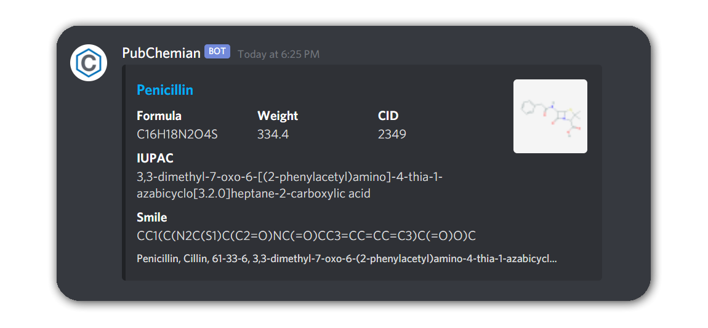

# PubChemian

PubChemian is a discord bot for https://pubchem.ncbi.nlm.nih.gov/.

### **[Invite to your server](https://discord.com/api/oauth2/authorize?client_id=815901654460137472&permissions=117824&scope=bot)**

## Usage

### `.search[.s] <keyword> (<*args>)`

To search compounds.

These are arguments.

`-translate[-t]` to translate a keyword to english. default is false.

`-limit[-l] <amount>` to limit to search. default is 1.

`-[smiles, cid, formula, name]` to change a search type. default is name.

`-image[-i]` to show structural formula as bigger.

`-thumbnail[-tb]` to show structural formula as smaller.

### `.help[.h]`

To show this help.

## Required Permissions

- Read Messages
- Send Messages
- Embed Links
- Read Message History
- Attach Files
- Add Reactions